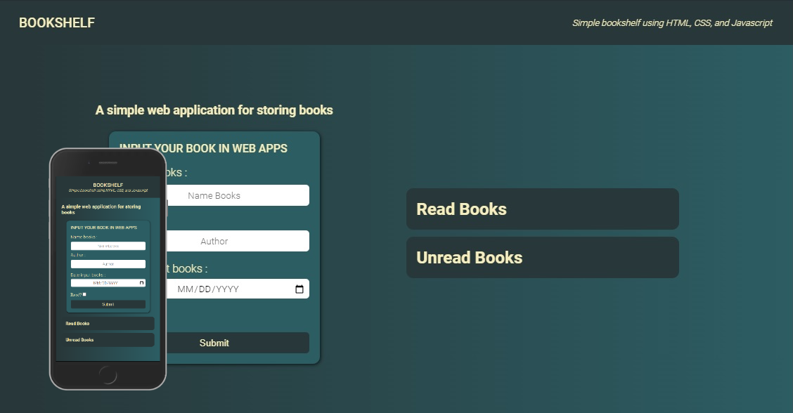

# Bookshelft Web Apps

sebuah web sederhana untuk memasukan buku ke rak buku, ada 2 rak buku yang pertama buku yang telah di baca dan yang ke dua buku yang belum di baca.

## Teknologi

Web ini di buat menggunakan HTML, CSS, Dan Javascript. Bisa menyipan data di local storage ketika di refresh data akan tersimpan di lokal storage dan data yang telah di input akan ada kembali.

## Latar Belakang

ini adalah tugas sumbission dari kelas Dicoding (Belajar Membuat Front-End Web untuk Pemula)

## License

[MIT](/apps/MIT%20License.txt)

## 🔗 Contact

