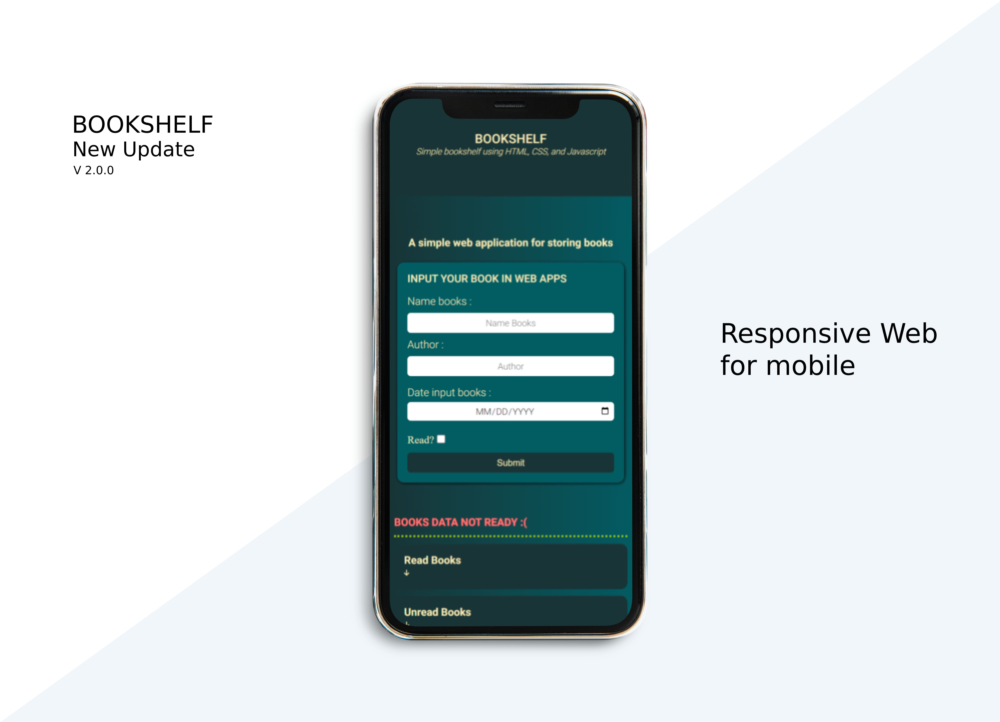

# Bookshelft Web Apps v 2.0.1

**Update V 2.0.1** A simple web to organize books into bookshelves, there are 2 bookshelves: the first is for books that have been read and the second is for books that have not been read.


- Update UI/UX

## New features V 2.0.1

- Responsive web for mobile. <br><br>
  
- New up and down buttons for read and unread books.
- If new data is added the text will change **"BOOKS DATA IS READY"**.
- If the browser is refreshed, if there is data in local storage, the text will change to **BOOKS DATA IS READY**

## Technology

This web is created using HTML, CSS, and Javascript. It can store data in local storage so that when the page is refreshed, the stored data will still be available. Any inputted data will be saved and appear again.

## Background

This is a summary assignment from the Dicoding class (Learning to Create a Front-End Web for Beginners)

## License

```
MIT License

Copyright (c) 2023 Adi Pratama jaya

Permission is hereby granted, free of charge, to any person obtaining a copy
of this software and associated documentation files (the "Software"), to deal
in the Software without restriction, including without limitation the rights
to use, copy, modify, merge, publish, distribute, sublicense, and/or sell
copies of the Software, and to permit persons to whom the Software is
furnished to do so, subject to the following conditions:

The above copyright notice and this permission notice shall be included in all
copies or substantial portions of the Software.

THE SOFTWARE IS PROVIDED "AS IS", WITHOUT WARRANTY OF ANY KIND, EXPRESS OR
IMPLIED, INCLUDING BUT NOT LIMITED TO THE WARRANTIES OF MERCHANTABILITY,
FITNESS FOR A PARTICULAR PURPOSE AND NONINFRINGEMENT. IN NO EVENT SHALL THE
AUTHORS OR COPYRIGHT HOLDERS BE LIABLE FOR ANY CLAIM, DAMAGES OR OTHER
LIABILITY, WHETHER IN AN ACTION OF CONTRACT, TORT OR OTHERWISE, ARISING FROM,
OUT OF OR IN CONNECTION WITH THE SOFTWARE OR THE USE OR OTHER DEALINGS IN THE
SOFTWARE.
```

#

Thank you for visiting my github. 🤓\
by Adi Pratama jaya

## 🔗 Contact

[](https://www.linkedin.com/in/adipratamajaya/)
[](<[https://www.linkedin.com/in/adipratamajaya/](https://www.instagram.com/apratama_x_x/)>)
[](<[https://www.linkedin.com/in/adipratamajaya/](https://www.youtube.com/c/Adipratamajaya)>)
